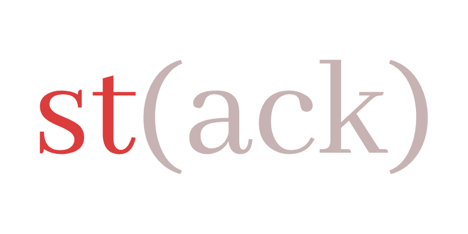
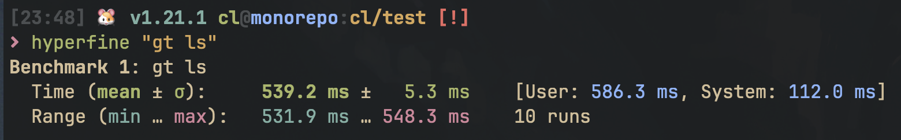

Testing!
Testing!
Testing!

<h1 align="center">
   
</h1>

<h4 align="center">
   Yet another tool for managing stacked PRs locally and on GitHub.
</h4>

<p align="center">
  <a href="https://github.com/clabby/st/actions/workflows/rust_ci.yaml"></a>
  
</p>

<p align="center">
  <a href="#why">Why?</a> •
  <a href="#usage">Usage</a> •
  <a href="#contributing">Contributing</a>
</p>

## Why?

I'm a long-time user and lover of [Graphite](https://github.com/withgraphite). I never quite used the graphite ecosystem
as intended - only the CLI. As the ecosystem expanded, I feared it would become a paid service, and that happened on
14 July 2023. However, I adore the CLI tool, and it's become a central part of my and my team's workflow.
Stacked PRs make code review + unblocking oneself easier, Graphite makes stacked PRs extremely easy to work with,
etc. Graphite also has some nice features with their web interface, slack integration, MacOS menu bar app, that I rarely
if ever used (cool I guess, though!)

My biggest gripe with Graphite is that they decided to disallow opting into the periphery services that cost them money
to operate, making the CLI dependent on their API and unusable in organizations without paying $99/month (_for 5 seats_).
Because I, nor most other Graphite lovers I talked to, ever use these parts of the service, I was pretty disappointed to
see:

```
ERROR: Your team's Graphite plan has expired. To continue using Graphite in <organization>, upgrade your
plan at https://app.graphite.dev/settings/billing?org=<organization>
```

Admittedly, this error message prompted the creation of this project. This tool aims to be an entirely client
side, minified version of the Graphite CLI's featureset. `st` is not a _service_, it is just a _tool_. It's also free
software - go crazy. If you enjoy using this tool, consider [buying me a beer if we ever meet](./LICENSE.md).

> [!NOTE]
>
> This tool is meant for the common-{wo}man working on open source projects, not for enterprise customers.
>
> If you're looking for a more feature-rich ecosystem for stacked PRs that has a support team,
> andressen-horowitz funding, etc., I do recommend checking out Graphite. They'll actually fix your bugs promptly.
> The Graphite team is great, and they've built something very special - so much so that `st` emulates its featureset.
> I just wish I could opt-out of the fancy stuff and not pay for work that is done client-side!
>
> If you're someone who doesn't care about features like AI code review, web interfaces, etc., and you just want
> to be able to manage PR stacks, this could be the tool for you.

### Why not [`git-branchless`](https://github.com/arxanas/git-branchless)?

Too complicated. The tool is far from focused on PR stacks, with tons of other features. Good tool, not for me. Graphite
feels good because it leads users into the [_pit of success_](https://blog.codinghorror.com/falling-into-the-pit-of-success/).
`git-branchless` is like `git`, in that it has so many features, it's highly likely its users don't even know about
all of them.

### Why not [`charcoal`](https://github.com/danerwilliams/charcoal)?

Very close to what I want, but:

1. Looks unmaintained. It's a fork of the formerly-open-source Graphite without dependencies on the propietary
   and pay-walled Graphite API, which I sung praises for above. However, it doesn't inherit some of the nice new
   features that I enjoy.
2. Doesn't have ergonomic aliases.
3. Doesn't support the comments on GitHub PRs that direct reviewers around the stack.
4. Similar to `graphite`, painfully slow. It's written in TypeScript, plus shells out to `git` constantly, making even
   operations like `gt ls` take > 500ms. I like my CLI tools snappy!



### Why not [`spr`](https://github.com/ejoffe/spr)?

Mainly because it's restrictive. I don't like the idea of 1 commit = 1 PR - it makes the workflow feel less fluid.
Again, nice tool, just not for me.

### Why not _yet-another-stacked-pr-tool_

Because I want to control my own destiny. We can end the conversation here...


## Usage

_TODO_

## Contributing

_TODO_
